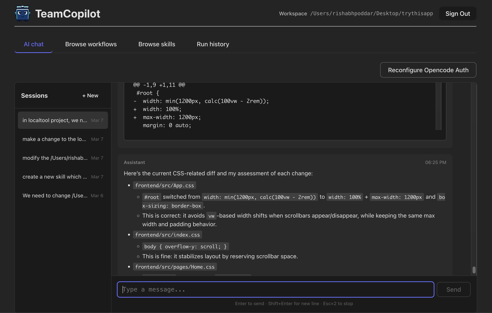

<div align="center">
  
</div>

# TeamCopilot
TeamCopilot helps technical and non-technical teams become more productive by enabling safe sharing of custom AI agent skills and tools.

## What makes TeamCopilot different

It's like Claude code / OpenAI Codex, except that:
- Multi-user environment: everyone uses the same agent setup. Configure once, the whole team can use it.
- Skill & tool permissions: control who can use which skills and tools through the agent. Example: allow only certain people in the team to use a skill for making server config changes.
- Approval workflow: anyone can create tools/skills, but engineers in the team must approve them before the agent can even see them.
- Fully auditable: chat sessions can’t be deleted by users and are stored on your server.
- Use it anywhere: web UI lets you talk to the agent even when you're away from your work machine.
- You can pick either OpenAI or Anthropic as your AI provider.

## Dashboard View



## Quick Start (Local)

### Prerequisites

- Node.js 20+
- npm
- Python 3.10+

### 1) Install

```bash
git clone https://github.com/rishabhpoddar/teamcopilot
cd teamcopilot
npm install
cd frontend && npm install && cd ..
```

### 2) Configure

```bash
cp .env.example .env
```

### 3) Build and start

```bash
npm run build
npm start
```

Open: **http://localhost:5124**

## Docker Setup

```bash
git clone https://github.com/rishabhpoddar/teamcopilot
cd teamcopilot
docker build -t teamcopilot .
docker run -d \
  --name teamcopilot \
  -p 5124:5124 \
  -v /path/to/some/folder:/app/workspaces \
  teamcopilot
```

Open: **http://localhost:5124**

## Common Environment Variables

| Variable | Description | Default |
|----------|-------------|---------|
| `WORKSPACE_DIR` | Directory where workflows are stored | `./my_workspaces` |
| `TEAMCOPILOT_HOST` | Server host | `0.0.0.0` |
| `TEAMCOPILOT_PORT` | Server port | `5124` |
| `OPENCODE_PORT` | Internal OpenCode server port | `4096` |
| `OPENCODE_MODEL` | Model used by OpenCode | `openai/gpt-5.3-codex` |

## User Management (CLI)

Create user:

```bash
npm run create-user
```

Change user role:

```bash
npm run change-user-role
```

Delete user:

```bash
npm run delete-user
```

Reset password:

```bash
npm run reset-password
```

Rotate JWT secret (invalidates existing tokens causing everyone to get logged out):

```bash
npm run rotate-jwt-secret
```

Users sign in at `/login`.

## Contributing

See [CONTRIBUTING.md](CONTRIBUTING.md).

## License

MIT
